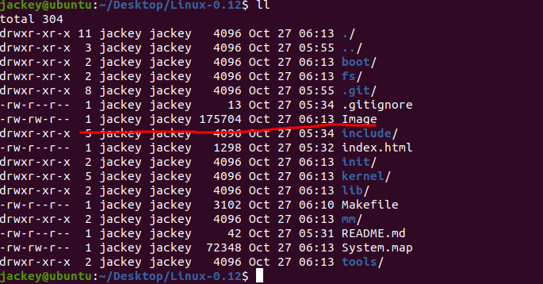

# Linux-0.12

Linux 0.12 with modern GCC

开发环境为：

| 软件   | 版本           | 备注 |
| ------ | -------------- | ---- |
| OS     | Ubuntu 20.04 LTS |
| GCC    | 9.3.0         |
| kernel | 5.11.0        |
| make | 4.2.1 |

2022.10.13测试

| 软件   | 版本           | 备注 |
| ------ | -------------- | ---- |
| OS     | Ubuntu 22.04.1 LTS |
| GCC    | 11.2.0        |
| kernel | 5.15.0        |
| make | 4.3 |

2023.5.18测试

| 软件   | 版本           | 备注 |
| ------ | -------------- | ---- |
| OS     | Linux Mint 21.1 vera(Ubuntu 22.04.2 LTS) |
| GCC    | 11.3.0        |
| kernel | 5.15.0        |
| make | 4.3 |

新版本的Linux内核代码量太多，我们选择早期的版本进行研究。

首先从赵炯先生的网站上下载源码，因为没有提供压缩包，我们只能爬下来。

```bash
wget -c -r -np -k -L -p http://www.oldlinux.org/Book-Lite/linux-0.12/
```

爬下来的文件包含一些例如HTML格式等等的无关文件，需要自行删除。

然后执行编译

```bash
make
```

## as86 no such file or directory

```bash
$ make
cpp -nostdinc -Iinclude -traditional boot/bootsect.S -o boot/bootsect.s
as86 -0 -a -o boot/bootsect.o boot/bootsect.s
make: as86: No such file or directory
make: *** [Makefile:97: boot/bootsect] Error 127
```

很明显是这个软件没有安装。

Manjaro安装：

```bash
yaourt -S bin86
```

## gas no such file or directory

```bash
$ make         
as86 -0 -a -o boot/bootsect.o boot/bootsect.s
ld86 -0 -s -o boot/bootsect boot/bootsect.o
cpp -nostdinc -Iinclude -traditional boot/setup.S -o boot/setup.s
as86 -0 -a -o boot/setup.o boot/setup.s
ld86 -0 -s -o boot/setup boot/setup.o
gas -c -o boot/head.o boot/head.s
make: gas: No such file or directory
make: *** [Makefile:35: boot/head.o] Error 127
```

gas等等已经改名为as了。

将gas改为as，gld改为ld，gar。

```bash
find -name "Makefile" -exec sed -i "s/gas/as/g" {} \;
find -name "Makefile" -exec sed -i "s/gld/ld/g" {} \;
find -name "Makefile" -exec sed -i "s/gar/ar/g" {} \;
```

## 问题三

```bash
$ make
as86 -0 -a -o boot/bootsect.o boot/bootsect.s
ld86 -0 -s -o boot/bootsect boot/bootsect.o
cpp -nostdinc -Iinclude -traditional boot/setup.S -o boot/setup.s
as86 -0 -a -o boot/setup.o boot/setup.s
ld86 -0 -s -o boot/setup boot/setup.o
as -c -o boot/head.o boot/head.s
boot/head.s: Assembler messages:
boot/head.s:43: Error: unsupported instruction `mov'
boot/head.s:47: Error: unsupported instruction `mov'
boot/head.s:59: Error: unsupported instruction `mov'
boot/head.s:61: Error: unsupported instruction `mov'
boot/head.s:136: Error: invalid instruction suffix for `push'
boot/head.s:137: Error: invalid instruction suffix for `push'
boot/head.s:138: Error: invalid instruction suffix for `push'
boot/head.s:139: Error: invalid instruction suffix for `push'
boot/head.s:140: Error: invalid instruction suffix for `push'
boot/head.s:151: Error: invalid instruction suffix for `push'
boot/head.s:152: Error: invalid instruction suffix for `push'
boot/head.s:153: Error: invalid instruction suffix for `push'
boot/head.s:154: Error: you can't `push %ds'
boot/head.s:155: Error: you can't `push %es'
boot/head.s:161: Error: invalid instruction suffix for `push'
boot/head.s:163: Error: invalid instruction suffix for `pop'
boot/head.s:165: Error: you can't `pop %es'
boot/head.s:166: Error: you can't `pop %ds'
boot/head.s:167: Error: invalid instruction suffix for `pop'
boot/head.s:168: Error: invalid instruction suffix for `pop'
boot/head.s:169: Error: invalid instruction suffix for `pop'
boot/head.s:170: Warning: no instruction mnemonic suffix given and no register operands; using default for `iret'
boot/head.s:214: Error: unsupported instruction `mov'
boot/head.s:215: Error: unsupported instruction `mov'
boot/head.s:217: Error: unsupported instruction `mov'
boot/head.s:231: Error: alignment not a power of 2
make: *** [Makefile:35: boot/head.o] Error 1
```

这是由于在64位机器上编译的原因，需要告诉编译器，我们要编译32位的code，在所有Makefile的AS后面添加 --32，CFLAGS中加-m32。

```bash
find -name "Makefile" -exec sed -i "s/as$/as --32/g" {} \;
find -name "Makefile" -exec sed -i "s/-O/-O -m32/g" {} \;
```

## 问题四

```bash
$ make
as --32 -c -o boot/head.o boot/head.s
boot/head.s: Assembler messages:
boot/head.s:231: Error: alignment not a power of 2
make: *** [Makefile:35: boot/head.o] Error 1
```

把align n -> align 2^n。

我的是align 3 ，将其转换为2^3=8。

```bash
sed -i 's/align 2/align 4/g' boot/head.s
sed -i 's/align 3/align 8/g' boot/head.s
```

## 问题五

```bash
$ make
as --32 -c -o boot/head.o boot/head.s
gcc  -Wall -O -fstrength-reduce -fomit-frame-pointer -fcombine-regs -mstring-insns \
-nostdinc -Iinclude -c -o init/main.o init/main.c
gcc: error: unrecognized command-line option ‘-fcombine-regs’
gcc: error: unrecognized command-line option ‘-mstring-insns’
make: *** [Makefile:37: init/main.o] Error 1
```

把这两个删掉即可，现在GCC已经不支持了。

```bash
find -name "Makefile" -exec sed -i "s/-fcombine-regs//g" {} \;
find -name "Makefile" -exec sed -i "s/-mstring-insns//g" {} \;
```

## 问题六

```bash
$ make
gcc  -Wall -O -fstrength-reduce -fomit-frame-pointer \
-nostdinc -Iinclude -c -o init/main.o init/main.c
In file included from include/sys/time.h:56,
                 from include/unistd.h:54,
                 from init/main.c:8:
include/time.h:46:8: warning: conflicting types for built-in function ‘strftime’; expected ‘long unsigned int(char *, long unsigned int,  const char *, const void *)’ [-Wbuiltin-declaration-mismatch]
   46 | size_t strftime(char * s, size_t smax, const char * fmt, const struct tm * tp);
      |        ^~~~~~~~
include/time.h:1:1: note: ‘strftime’ is declared in header ‘<time.h>’
  +++ |+#include <time.h>
    1 | #ifndef _TIME_H
In file included from init/main.c:8:
init/main.c:23:29: error: static declaration of ‘fork’ follows non-static declaration
   23 | static inline _syscall0(int,fork)
      |                             ^~~~
include/unistd.h:151:6: note: in definition of macro ‘_syscall0’
  151 | type name(void) \
      |      ^~~~
include/unistd.h:227:5: note: previous declaration of ‘fork’ with type ‘int(void)’
  227 | int fork(void);
      |     ^~~~
init/main.c:24:29: error: static declaration of ‘pause’ follows non-static declaration
   24 | static inline _syscall0(int,pause)
      |                             ^~~~~
include/unistd.h:151:6: note: in definition of macro ‘_syscall0’
  151 | type name(void) \
      |      ^~~~
include/unistd.h:241:5: note: previous declaration of ‘pause’ with type ‘int(void)’
  241 | int pause(void);
      |     ^~~~~
init/main.c:26:29: error: static declaration of ‘sync’ follows non-static declaration
   26 | static inline _syscall0(int,sync)
      |                             ^~~~
include/unistd.h:151:6: note: in definition of macro ‘_syscall0’
  151 | type name(void) \
      |      ^~~~
include/unistd.h:252:5: note: previous declaration of ‘sync’ with type ‘int(void)’
  252 | int sync(void);
      |     ^~~~
In file included from include/linux/mm.h:6,
                 from include/linux/sched.h:36,
                 from init/main.c:29:
include/linux/kernel.h:11:8: warning: conflicting types for built-in function ‘malloc’; expected ‘void *(long unsigned int)’ [-Wbuiltin-declaration-mismatch]
   11 | void * malloc(unsigned int size);
      |        ^~~~~~
include/linux/kernel.h:1:1: note: ‘malloc’ is declared in header ‘<stdlib.h>’
  +++ |+#include <stdlib.h>
    1 | /*
In file included from init/main.c:42:
include/string.h:38:22: warning: conflicting types for built-in function ‘strncpy’; expected ‘char *(char *, const char *, long unsigned int)’ [-Wbuiltin-declaration-mismatch]
   38 | extern inline char * strncpy(char * dest,const char *src,int count)
      |                      ^~~~~~~
include/string.h:1:1: note: ‘strncpy’ is declared in header ‘<string.h>’
  +++ |+#include <string.h>
    1 | #ifndef _STRING_H_
include/string.h:68:22: warning: conflicting types for built-in function ‘strncat’; expected ‘char *(char *, const char *, long unsigned int)’ [-Wbuiltin-declaration-mismatch]
   68 | extern inline char * strncat(char * dest,const char * src,int count)
      |                      ^~~~~~~
include/string.h:68:22: note: ‘strncat’ is declared in header ‘<string.h>’
include/string.h:107:19: warning: conflicting types for built-in function ‘strncmp’; expected ‘int(const char *, const char *, long unsigned int)’ [-Wbuiltin-declaration-mismatch]
  107 | extern inline int strncmp(const char * cs,const char * ct,int count)
      |                   ^~~~~~~
include/string.h:107:19: note: ‘strncmp’ is declared in header ‘<string.h>’
include/string.h:128:22: warning: conflicting types for built-in function ‘strchr’; expected ‘char *(const char *, int)’ [-Wbuiltin-declaration-mismatch]
  128 | extern inline char * strchr(const char * s,char c)
      |                      ^~~~~~
include/string.h:128:22: note: ‘strchr’ is declared in header ‘<string.h>’
include/string.h:145:22: warning: conflicting types for built-in function ‘strrchr’; expected ‘char *(const char *, int)’ [-Wbuiltin-declaration-mismatch]
  145 | extern inline char * strrchr(const char * s,char c)
      |                      ^~~~~~~
include/string.h:145:22: note: ‘strrchr’ is declared in header ‘<string.h>’
include/string.h:161:19: warning: conflicting types for built-in function ‘strspn’; expected ‘long unsigned int(const char *, const char *)’ [-Wbuiltin-declaration-mismatch]
  161 | extern inline int strspn(const char * cs, const char * ct)
      |                   ^~~~~~
include/string.h:161:19: note: ‘strspn’ is declared in header ‘<string.h>’
include/string.h:185:19: warning: conflicting types for built-in function ‘strcspn’; expected ‘long unsigned int(const char *, const char *)’ [-Wbuiltin-declaration-mismatch]
  185 | extern inline int strcspn(const char * cs, const char * ct)
      |                   ^~~~~~~
include/string.h:185:19: note: ‘strcspn’ is declared in header ‘<string.h>’
include/string.h:263:19: warning: conflicting types for built-in function ‘strlen’; expected ‘long unsigned int(const char *)’ [-Wbuiltin-declaration-mismatch]
  263 | extern inline int strlen(const char * s)
      |                   ^~~~~~
include/string.h:263:19: note: ‘strlen’ is declared in header ‘<string.h>’
include/string.h:336:22: warning: conflicting types for built-in function ‘memcpy’; expected ‘void *(void *, const void *, long unsigned int)’ [-Wbuiltin-declaration-mismatch]
  336 | extern inline void * memcpy(void * dest,const void * src, int n)
      |                      ^~~~~~
include/string.h:336:22: note: ‘memcpy’ is declared in header ‘<string.h>’
include/string.h:346:22: warning: conflicting types for built-in function ‘memmove’; expected ‘void *(void *, const void *, long unsigned int)’ [-Wbuiltin-declaration-mismatch]
  346 | extern inline void * memmove(void * dest,const void * src, int n)
      |                      ^~~~~~~
include/string.h:346:22: note: ‘memmove’ is declared in header ‘<string.h>’
include/string.h:363:19: warning: conflicting types for built-in function ‘memcmp’; expected ‘int(const void *, const void *, long unsigned int)’ [-Wbuiltin-declaration-mismatch]
  363 | extern inline int memcmp(const void * cs,const void * ct,int count)
      |                   ^~~~~~
include/string.h:363:19: note: ‘memcmp’ is declared in header ‘<string.h>’
include/string.h:379:22: warning: conflicting types for built-in function ‘memchr’; expected ‘void *(const void *, int,  long unsigned int)’ [-Wbuiltin-declaration-mismatch]
  379 | extern inline void * memchr(const void * cs,char c,int count)
      |                      ^~~~~~
include/string.h:379:22: note: ‘memchr’ is declared in header ‘<string.h>’
include/string.h:395:22: warning: conflicting types for built-in function ‘memset’; expected ‘void *(void *, int,  long unsigned int)’ [-Wbuiltin-declaration-mismatch]
  395 | extern inline void * memset(void * s,char c,int count)
      |                      ^~~~~~
include/string.h:395:22: note: ‘memset’ is declared in header ‘<string.h>’
init/main.c:47:1: warning: ‘format’ attribute cannot be applied to a function that does not take variable arguments [-Wattributes]
   47 | extern int vsprintf();
      | ^~~~~~
init/main.c: In function ‘sprintf’:
init/main.c:63:32: warning: passing argument 3 of ‘vsprintf’ from incompatible pointer type [-Wincompatible-pointer-types]
   63 |         i = vsprintf(str, fmt, args);
      |                                ^~~~
      |                                |
      |                                va_list {aka char *}
init/main.c:47:12: note: expected ‘__va_list_tag *’ but argument is of type ‘va_list’ {aka ‘char *’}
   47 | extern int vsprintf();
      |            ^~~~~~~~
init/main.c: At top level:
init/main.c:127:6: warning: return type of ‘main’ is not ‘int’ [-Wmain]
  127 | void main(void)         /* This really IS void, no error here. */
      |      ^~~~
init/main.c:179:12: error: static declaration of ‘printf’ follows non-static declaration
  179 | static int printf(const char *fmt, ...)
      |            ^~~~~~
In file included from include/linux/mm.h:6,
                 from include/linux/sched.h:36,
                 from init/main.c:29:
include/linux/kernel.h:7:5: note: previous declaration of ‘printf’ with type ‘int(const char *, ...)’
    7 | int printf(const char * fmt, ...);
      |     ^~~~~~
init/main.c: In function ‘printf’:
init/main.c:185:52: warning: passing argument 3 of ‘vsprintf’ from incompatible pointer type [-Wincompatible-pointer-types]
  185 |         write(1,printbuf,i=vsprintf(printbuf, fmt, args));
      |                                                    ^~~~
      |                                                    |
      |                                                    va_list {aka char *}
init/main.c:47:12: note: expected ‘__va_list_tag *’ but argument is of type ‘va_list’ {aka ‘char *’}
   47 | extern int vsprintf();
      |            ^~~~~~~~
make: *** [Makefile:36: init/main.o] Error 1

```

这里是由于include/unistd.h中声明了一次pause()/sync()/fork(), 而在main.c 中通过宏又定义了这三个函数，但定义时多了static 限定，与声明不同，所以出错。所以直接把unistd.h中的声明去掉，或者把static去掉。

```bash
sed -i 's/static inline/inline/g' init/main.c
sed -i 's/static int printf/int printf/g' init/main.c
```

## 问题七

```bash
In file included from init/main.c:42:
include/string.h: In function ‘strcpy’:
include/string.h:29:1: error: ‘asm’ operand has impossible constraints
   29 | __asm__("cld\n"
      | ^~~~~~~
make: *** [Makefile:36: init/main.o] Error 1
```

类似的问题在后面编译中出现好多，C内嵌汇编的格式__asm__(汇编语句：输入寄存器：输出寄存器：可能被修改的寄存器)，最新的GCC规定输入或输出寄存器不能出现在可能被修改的寄存器中，目前看到网上的方法是把所有类似问题的可能被修改的寄存器全部删掉。

在代码目录执行：

```bash
find -type f -exec sed -i 's/:\"\w\{2\}\"\(,\"\w\{2\}\"\)*)/:) /g' {} \;
```

## 问题八

```bash
../include/asm/segment.h: Assembler messages:
../include/asm/segment.h:21: Error: incorrect register `%rax' used with `l' suffix
../include/asm/segment.h:37: Error: incorrect register `%rdi' used with `l' suffix
sched.c:165: Warning: indirect ljmp without `*'
sched.c:435: Error: invalid instruction suffix for `pushf'
sched.c:435: Error: invalid instruction suffix for `popf'
make[1]: *** [Makefile:24: sched.o] Error 1
make[1]: Leaving directory '/home/jackey/Documents/Linux0.12/kernel'
make: *** [Makefile:74: kernel/kernel.o] Error 2
```

l的意思就是32bit的意思，将movl等代码修改为mov。

修改方法在问题三的第二行

## 问题九

```bash
gcc -Wall -O -fstrength-reduce -fomit-frame-pointer -finline-functions -nostdinc -I../include -m32 \
-c -o signal.o signal.c
gcc -Wall -O -fstrength-reduce -fomit-frame-pointer -finline-functions -nostdinc -I../include -m32 \
-c -o mktime.o mktime.c
ld -r -o kernel.o sched.o sys_call.o traps.o asm.o fork.o panic.o printk.o vsprintf.o sys.o exit.o signal.o mktime.o
ld: traps.o: in function `oom':
traps.c:(.text+0x498): multiple definition of `oom'; sched.o:sched.c:(.text+0xe0): first defined here
ld: traps.o: in function `get_fs_byte':
traps.c:(.text+0x4c4): multiple definition of `get_fs_byte'; sched.o:sched.c:(.text+0x104): first defined here
ld: traps.o: in function `get_fs_word':
traps.c:(.text+0x4cc): multiple definition of `get_fs_word'; sched.o:sched.c:(.text+0x108): first defined here
ld: traps.o: in function `get_fs_long':
traps.c:(.text+0x4d5): multiple definition of `get_fs_long'; sched.o:sched.c:(.text+0x10d): first defined here
ld: traps.o: in function `put_fs_byte':
traps.c:(.text+0x4dd): multiple definition of `put_fs_byte'; sched.o:sched.c:(.text+0x112): first defined here
ld: traps.o: in function `put_fs_word':
traps.c:(.text+0x4ea): multiple definition of `put_fs_word'; sched.o:sched.c:(.text+0x117): first defined here
ld: traps.o: in function `put_fs_long':
traps.c:(.text+0x4f8): multiple definition of `put_fs_long'; sched.o:sched.c:(.text+0x11c): first defined here
ld: traps.o: in function `get_fs':
traps.c:(.text+0x504): multiple definition of `get_fs'; sched.o:sched.c:(.text+0x121): first defined here
ld: traps.o: in function `get_ds':
traps.c:(.text+0x50b): multiple definition of `get_ds'; sched.o:sched.c:(.text+0x128): first defined here
ld: traps.o: in function `set_fs':
traps.c:(.text+0x512): multiple definition of `set_fs'; sched.o:sched.c:(.text+0x12f): first defined here
ld: fork.o: in function `oom':
fork.c:(.text+0x0): multiple definition of `oom'; sched.o:sched.c:(.text+0xe0): first defined here
ld: fork.o: in function `get_fs_byte':
fork.c:(.text+0x2c): multiple definition of `get_fs_byte'; sched.o:sched.c:(.text+0x104): first defined here
ld: fork.o: in function `get_fs_word':
fork.c:(.text+0x34): multiple definition of `get_fs_word'; sched.o:sched.c:(.text+0x108): first defined here
ld: fork.o: in function `get_fs_long':
fork.c:(.text+0x3d): multiple definition of `get_fs_long'; sched.o:sched.c:(.text+0x10d): first defined here
ld: fork.o: in function `put_fs_byte':
fork.c:(.text+0x45): multiple definition of `put_fs_byte'; sched.o:sched.c:(.text+0x112): first defined here
ld: fork.o: in function `put_fs_word':
fork.c:(.text+0x52): multiple definition of `put_fs_word'; sched.o:sched.c:(.text+0x117): first defined here
ld: fork.o: in function `put_fs_long':
fork.c:(.text+0x60): multiple definition of `put_fs_long'; sched.o:sched.c:(.text+0x11c): first defined here
ld: fork.o: in function `get_fs':
fork.c:(.text+0x6c): multiple definition of `get_fs'; sched.o:sched.c:(.text+0x121): first defined here
ld: fork.o: in function `get_ds':
fork.c:(.text+0x73): multiple definition of `get_ds'; sched.o:sched.c:(.text+0x128): first defined here
ld: fork.o: in function `set_fs':
fork.c:(.text+0x7a): multiple definition of `set_fs'; sched.o:sched.c:(.text+0x12f): first defined here
ld: panic.o: in function `oom':
panic.c:(.text+0x0): multiple definition of `oom'; sched.o:sched.c:(.text+0xe0): first defined here
ld: vsprintf.o: in function `strcpy':
vsprintf.c:(.text+0x272): multiple definition of `strcpy'; traps.o:traps.c:(.text+0x180): first defined here
ld: vsprintf.o: in function `strncpy':
vsprintf.c:(.text+0x288): multiple definition of `strncpy'; traps.o:traps.c:(.text+0x196): first defined here
ld: vsprintf.o: in function `strcat':
vsprintf.c:(.text+0x2a7): multiple definition of `strcat'; traps.o:traps.c:(.text+0x1b5): first defined here
ld: vsprintf.o: in function `strncat':
vsprintf.c:(.text+0x2ca): multiple definition of `strncat'; traps.o:traps.c:(.text+0x1d8): first defined here
ld: vsprintf.o: in function `strcmp':
vsprintf.c:(.text+0x2f7): multiple definition of `strcmp'; traps.o:traps.c:(.text+0x205): first defined here
ld: vsprintf.o: in function `strncmp':
vsprintf.c:(.text+0x31a): multiple definition of `strncmp'; traps.o:traps.c:(.text+0x228): first defined here
ld: vsprintf.o: in function `strchr':
vsprintf.c:(.text+0x344): multiple definition of `strchr'; traps.o:traps.c:(.text+0x252): first defined here
ld: vsprintf.o: in function `strrchr':
vsprintf.c:(.text+0x363): multiple definition of `strrchr'; traps.o:traps.c:(.text+0x271): first defined here
ld: vsprintf.o: in function `strspn':
vsprintf.c:(.text+0x384): multiple definition of `strspn'; traps.o:traps.c:(.text+0x292): first defined here
ld: vsprintf.o: in function `strcspn':
vsprintf.c:(.text+0x3b7): multiple definition of `strcspn'; traps.o:traps.c:(.text+0x2c5): first defined here
ld: vsprintf.o: in function `strpbrk':
vsprintf.c:(.text+0x3ea): multiple definition of `strpbrk'; traps.o:traps.c:(.text+0x2f8): first defined here
ld: vsprintf.o: in function `strstr':
vsprintf.c:(.text+0x41d): multiple definition of `strstr'; traps.o:traps.c:(.text+0x32b): first defined here
ld: vsprintf.o: in function `strlen':
vsprintf.c:(.text+0x450): multiple definition of `strlen'; traps.o:traps.c:(.text+0x35e): first defined here
ld: vsprintf.o: in function `strtok':
vsprintf.c:(.text+0x469): multiple definition of `strtok'; traps.o:traps.c:(.text+0x377): first defined here
ld: vsprintf.o: in function `memcpy':
vsprintf.c:(.text+0x4ee): multiple definition of `memcpy'; traps.o:traps.c:(.text+0x3fc): first defined here
ld: vsprintf.o: in function `memmove':
vsprintf.c:(.text+0x504): multiple definition of `memmove'; traps.o:traps.c:(.text+0x412): first defined here
ld: vsprintf.o: in function `memcmp':
vsprintf.c:(.text+0x52a): multiple definition of `memcmp'; traps.o:traps.c:(.text+0x438): first defined here
ld: vsprintf.o: in function `memchr':
vsprintf.c:(.text+0x54e): multiple definition of `memchr'; traps.o:traps.c:(.text+0x45c): first defined here
ld: vsprintf.o: in function `memset':
vsprintf.c:(.text+0x575): multiple definition of `memset'; traps.o:traps.c:(.text+0x483): first defined here
ld: sys.o: in function `oom':
sys.c:(.text+0x0): multiple definition of `oom'; sched.o:sched.c:(.text+0xe0): first defined here
ld: sys.o: in function `get_fs_byte':
sys.c:(.text+0x2c): multiple definition of `get_fs_byte'; sched.o:sched.c:(.text+0x104): first defined here
ld: sys.o: in function `get_fs_word':
sys.c:(.text+0x34): multiple definition of `get_fs_word'; sched.o:sched.c:(.text+0x108): first defined here
ld: sys.o: in function `get_fs_long':
sys.c:(.text+0x3d): multiple definition of `get_fs_long'; sched.o:sched.c:(.text+0x10d): first defined here
ld: sys.o: in function `put_fs_byte':
sys.c:(.text+0x45): multiple definition of `put_fs_byte'; sched.o:sched.c:(.text+0x112): first defined here
ld: sys.o: in function `put_fs_word':
sys.c:(.text+0x52): multiple definition of `put_fs_word'; sched.o:sched.c:(.text+0x117): first defined here
ld: sys.o: in function `put_fs_long':
sys.c:(.text+0x60): multiple definition of `put_fs_long'; sched.o:sched.c:(.text+0x11c): first defined here
ld: sys.o: in function `get_fs':
sys.c:(.text+0x6c): multiple definition of `get_fs'; sched.o:sched.c:(.text+0x121): first defined here
ld: sys.o: in function `get_ds':
sys.c:(.text+0x73): multiple definition of `get_ds'; sched.o:sched.c:(.text+0x128): first defined here
ld: sys.o: in function `set_fs':
sys.c:(.text+0x7a): multiple definition of `set_fs'; sched.o:sched.c:(.text+0x12f): first defined here
ld: sys.o: in function `strcpy':
sys.c:(.text+0x81): multiple definition of `strcpy'; traps.o:traps.c:(.text+0x180): first defined here
ld: sys.o: in function `strncpy':
sys.c:(.text+0x97): multiple definition of `strncpy'; traps.o:traps.c:(.text+0x196): first defined here
ld: sys.o: in function `strcat':
sys.c:(.text+0xb6): multiple definition of `strcat'; traps.o:traps.c:(.text+0x1b5): first defined here
ld: sys.o: in function `strncat':
sys.c:(.text+0xd9): multiple definition of `strncat'; traps.o:traps.c:(.text+0x1d8): first defined here
ld: sys.o: in function `strcmp':
sys.c:(.text+0x106): multiple definition of `strcmp'; traps.o:traps.c:(.text+0x205): first defined here
ld: sys.o: in function `strncmp':
sys.c:(.text+0x129): multiple definition of `strncmp'; traps.o:traps.c:(.text+0x228): first defined here
ld: sys.o: in function `strchr':
sys.c:(.text+0x153): multiple definition of `strchr'; traps.o:traps.c:(.text+0x252): first defined here
ld: sys.o: in function `strrchr':
sys.c:(.text+0x172): multiple definition of `strrchr'; traps.o:traps.c:(.text+0x271): first defined here
ld: sys.o: in function `strspn':
sys.c:(.text+0x193): multiple definition of `strspn'; traps.o:traps.c:(.text+0x292): first defined here
ld: sys.o: in function `strcspn':
sys.c:(.text+0x1c6): multiple definition of `strcspn'; traps.o:traps.c:(.text+0x2c5): first defined here
ld: sys.o: in function `strpbrk':
sys.c:(.text+0x1f9): multiple definition of `strpbrk'; traps.o:traps.c:(.text+0x2f8): first defined here
ld: sys.o: in function `strstr':
sys.c:(.text+0x22c): multiple definition of `strstr'; traps.o:traps.c:(.text+0x32b): first defined here
ld: sys.o: in function `strlen':
sys.c:(.text+0x25f): multiple definition of `strlen'; traps.o:traps.c:(.text+0x35e): first defined here
ld: sys.o: in function `strtok':
sys.c:(.text+0x278): multiple definition of `strtok'; traps.o:traps.c:(.text+0x377): first defined here
ld: sys.o: in function `memcpy':
sys.c:(.text+0x2fd): multiple definition of `memcpy'; traps.o:traps.c:(.text+0x3fc): first defined here
ld: sys.o: in function `memmove':
sys.c:(.text+0x313): multiple definition of `memmove'; traps.o:traps.c:(.text+0x412): first defined here
ld: sys.o: in function `memcmp':
sys.c:(.text+0x339): multiple definition of `memcmp'; traps.o:traps.c:(.text+0x438): first defined here
ld: sys.o: in function `memchr':
sys.c:(.text+0x35d): multiple definition of `memchr'; traps.o:traps.c:(.text+0x45c): first defined here
ld: sys.o: in function `memset':
sys.c:(.text+0x384): multiple definition of `memset'; traps.o:traps.c:(.text+0x483): first defined here
ld: exit.o: in function `get_fs_byte':
exit.c:(.text+0x44): multiple definition of `get_fs_byte'; sched.o:sched.c:(.text+0x104): first defined here
ld: exit.o: in function `get_fs_word':
exit.c:(.text+0x4c): multiple definition of `get_fs_word'; sched.o:sched.c:(.text+0x108): first defined here
ld: exit.o: in function `get_fs_long':
exit.c:(.text+0x55): multiple definition of `get_fs_long'; sched.o:sched.c:(.text+0x10d): first defined here
ld: exit.o: in function `put_fs_byte':
exit.c:(.text+0x5d): multiple definition of `put_fs_byte'; sched.o:sched.c:(.text+0x112): first defined here
ld: exit.o: in function `put_fs_word':
exit.c:(.text+0x6a): multiple definition of `put_fs_word'; sched.o:sched.c:(.text+0x117): first defined here
ld: exit.o: in function `put_fs_long':
exit.c:(.text+0x78): multiple definition of `put_fs_long'; sched.o:sched.c:(.text+0x11c): first defined here
ld: exit.o: in function `get_fs':
exit.c:(.text+0x84): multiple definition of `get_fs'; sched.o:sched.c:(.text+0x121): first defined here
ld: exit.o: in function `get_ds':
exit.c:(.text+0x8b): multiple definition of `get_ds'; sched.o:sched.c:(.text+0x128): first defined here
ld: exit.o: in function `set_fs':
exit.c:(.text+0x92): multiple definition of `set_fs'; sched.o:sched.c:(.text+0x12f): first defined here
ld: exit.o: in function `oom':
exit.c:(.text+0xc01): multiple definition of `oom'; sched.o:sched.c:(.text+0xe0): first defined here
ld: signal.o: in function `oom':
signal.c:(.text+0x0): multiple definition of `oom'; sched.o:sched.c:(.text+0xe0): first defined here
ld: signal.o: in function `get_fs_byte':
signal.c:(.text+0x2c): multiple definition of `get_fs_byte'; sched.o:sched.c:(.text+0x104): first defined here
ld: signal.o: in function `get_fs_word':
signal.c:(.text+0x34): multiple definition of `get_fs_word'; sched.o:sched.c:(.text+0x108): first defined here
ld: signal.o: in function `get_fs_long':
signal.c:(.text+0x3d): multiple definition of `get_fs_long'; sched.o:sched.c:(.text+0x10d): first defined here
ld: signal.o: in function `put_fs_byte':
signal.c:(.text+0x45): multiple definition of `put_fs_byte'; sched.o:sched.c:(.text+0x112): first defined here
ld: signal.o: in function `put_fs_word':
signal.c:(.text+0x52): multiple definition of `put_fs_word'; sched.o:sched.c:(.text+0x117): first defined here
ld: signal.o: in function `put_fs_long':
signal.c:(.text+0x60): multiple definition of `put_fs_long'; sched.o:sched.c:(.text+0x11c): first defined here
ld: signal.o: in function `get_fs':
signal.c:(.text+0x6c): multiple definition of `get_fs'; sched.o:sched.c:(.text+0x121): first defined here
ld: signal.o: in function `get_ds':
signal.c:(.text+0x73): multiple definition of `get_ds'; sched.o:sched.c:(.text+0x128): first defined here
ld: signal.o: in function `set_fs':
signal.c:(.text+0x7a): multiple definition of `set_fs'; sched.o:sched.c:(.text+0x12f): first defined here
ld: relocatable linking with relocations from format elf32-i386 (sys_call.o) to format elf64-x86-64 (kernel.o) is not supported
make[1]: *** [Makefile:32: kernel.o] Error 1
make[1]: Leaving directory '/home/jackey/Documents/Linux0.12/kernel'
make: *** [Makefile:74: kernel/kernel.o] Error 2
```

segment.h中定义的函数extern inline全部改成static inline
string.h中定义的函数extern inline全部改成static inline
mm.h中定义的函数extern inline全部改成static inline

```bash
sed -i 's/extern inline/static inline/g' include/asm/segment.h
sed -i 's/extern inline/static inline/g' include/string.h
sed -i 's/extern inline/static inline/g' include/linux/mm.h
```

## 问题十

```bash
gcc -Wall -O -fstrength-reduce -fomit-frame-pointer -finline-functions -nostdinc -I../include -m32 \
-c -o signal.o signal.c
ld -r -o kernel.o sched.o sys_call.o traps.o asm.o fork.o panic.o printk.o vsprintf.o sys.o exit.o signal.o mktime.o
ld: relocatable linking with relocations from format elf32-i386 (sched.o) to format elf64-x86-64 (kernel.o) is not supported
make[1]: *** [Makefile:32: kernel.o] Error 1
make[1]: Leaving directory '/home/jackey/Documents/Linux0.12/kernel'
make: *** [Makefile:74: kernel/kernel.o] Error 2
```

告诉ld以32位链接，在ld命令后面加 -m elf_i386

```bash
find -name "Makefile" -exec sed -i "s/ld$/ld -m elf_i386/g" {} \;
```

## 问题十一

```bash
exec.c: In function ‘copy_strings’:
exec.c:162:72: error: lvalue required as left operand of assignment
  162 |                                    !(pag = (char *) page[p/PAGE_SIZE] =
      |                                                                       ^

exec.c: In function ‘do_execve’:
exec.c:264:21: warning: suggest parentheses around assignment used as truth value [-Wparentheses]
  264 |                 if (cp = strchr(buf, '\n')) {
      |                     ^~
make[1]: *** [Makefile:13: exec.o] Error 1
make[1]: Leaving directory '/home/jackey/Documents/Linux0.12/fs'
make: *** [Makefile:80: fs/fs.o] Error 2
```

将fs/exec.c中162行的：

```cpp
if (!(pag = (char *) page[p/PAGE_SIZE]) &&
	!(pag = (char *) page[p/PAGE_SIZE] =
	(unsigned long *) get_free_page())) 
return 0;
```

改为：

```bash
if ((!page[p/PAGE_SIZE]) &&
      !(page[p/PAGE_SIZE] =
	(unsigned long *) get_free_page()))
	return 0;                      
else pag = (char *) page[p/PAGE_SIZE];
```

## 问题十二

```bash
malloc.c: In function ‘malloc’:
malloc.c:156:60: error: lvalue required as left operand of assignment
  156 |                 bdesc->page = bdesc->freeptr = (void *) cp = get_free_page();
      |                                                            ^
make[1]: *** [Makefile:24: malloc.o] Error 1
make[1]: Leaving directory '/home/jackey/Documents/Linux0.12/lib'
make: *** [Makefile:83: lib/lib.a] Error 2
```

将lib/malloc.c的156行：

```cpp
bdesc->page = bdesc->freeptr = (void *) cp = get_free_page();
```

修改为：

```cpp
cp = get_free_page();
bdesc->page = bdesc->freeptr = (void *) cp;
```

## 问题

```bash
get_put.c: In function ‘put_BCD’:
get_put.c:240:1: error: unsupported size for integer register
  240 | }
      | ^
make[1]: *** [Makefile:24: get_put.o] Error 1
make[1]: Leaving directory '/home/hyper/Documents/Linux0.12/kernel/math'
make: *** [Makefile:66: kernel/math/math.a] Error 2
```

上述错误需要关闭编译优化来解决，将文件所在的kernel/math/Makefile中的CFLAGS后的-O删除，然后重新编译。

此错误在Manjaro系统上没出现，在Ubuntu 20.04上出现

## 问题

```bash
ld: kernel/blk_drv/blk_drv.a(hd.o): in function `unlock_buffer':
hd.c:(.text+0x99f): multiple definition of `unlock_buffer'; kernel/blk_drv/blk_drv.a(floppy.o):floppy.c:(.text+0x804): first defined here
ld: kernel/blk_drv/blk_drv.a(hd.o): in function `end_request':
hd.c:(.text+0x9e3): multiple definition of `end_request'; kernel/blk_drv/blk_drv.a(floppy.o):floppy.c:(.text+0x848): first defined here
ld: kernel/blk_drv/blk_drv.a(ramdisk.o): in function `unlock_buffer':
ramdisk.c:(.text+0x2d8): multiple definition of `unlock_buffer'; kernel/blk_drv/blk_drv.a(floppy.o):floppy.c:(.text+0x804): first defined here
ld: kernel/blk_drv/blk_drv.a(ramdisk.o): in function `end_request':
ramdisk.c:(.text+0x31c): multiple definition of `end_request'; kernel/blk_drv/blk_drv.a(floppy.o):floppy.c:(.text+0x848): first defined here
```

和之前的问题一样

```bash
sed -i 's/extern inline/static inline/g' kernel/blk_drv/blk.h
```

## 问题

```bash
ld: warning: cannot find entry symbol _start; defaulting to 0000000008049000
ld: boot/head.o: in function `startup_32':
(.text+0x10): undefined reference to `_stack_start'
ld: (.text+0x2e): undefined reference to `_stack_start'
ld: boot/head.o: in function `after_page_tables':
(.text+0x540c): undefined reference to `_main'
ld: boot/head.o: in function `ignore_int':
(.text+0x5440): undefined reference to `_printk'
```

这是因为ld在将所有目标文件链接起来时，不知道程序的入口点在哪里。由内核的启动过程知其从head.s中开始执行，因此给boot/head.s的 .text 段添加一句 .globl startup_32，然后给根目录 ./Makefile 中的ld加上选项 -e startup_32 以指定入口点。

```bash
sed -i 's/ld$/ld -e startup_32/g' Makefile
```

## 问题

```bash
ld: boot/head.o: in function `_pg_dir':
(.text+0x10): undefined reference to `_stack_start'
ld: (.text+0x2e): undefined reference to `_stack_start'
ld: boot/head.o: in function `after_page_tables':
(.text+0x540c): undefined reference to `_main'
ld: boot/head.o: in function `ignore_int':
(.text+0x5440): undefined reference to `_printk'
ld: init/main.o: in function `init':
main.c:(.text+0x27b): undefined reference to `puts'
ld: kernel/kernel.o: in function `schedule':
(.text+0x3d8): undefined reference to `_current'
ld: (.text+0x3e5): undefined reference to `_current'
ld: (.text+0x3ef): undefined reference to `_last_task_used_math'
ld: (.text+0x40d): undefined reference to `__stack_chk_fail_local'
ld: kernel/kernel.o: in function `sched_init':
(.text+0x98a): undefined reference to `gdt'
ld: (.text+0xa46): undefined reference to `idt'
ld: (.text+0xa51): undefined reference to `timer_interrupt'
ld: (.text+0xa7c): undefined reference to `system_call'
ld: kernel/kernel.o: in function `reschedule':
sys_call.o:(.text+0xaa2): undefined reference to `_schedule'
ld: kernel/kernel.o: in function `_system_call':
(.text+0xac0): undefined reference to `_NR_syscalls'
ld: (.text+0xac9): undefined reference to `_sys_call_table'
ld: (.text+0xacf): undefined reference to `_current'
ld: kernel/kernel.o: in function `ret_from_sys_call':
sys_call.o:(.text+0xadf): undefined reference to `_current'
ld: sys_call.o:(.text+0xae5): undefined reference to `_task'
ld: sys_call.o:(.text+0xb16): undefined reference to `_do_signal'
ld: kernel/kernel.o: in function `_coprocessor_error':
(.text+0xb4c): undefined reference to `_math_error'
ld: kernel/kernel.o: in function `_device_not_available':
(.text+0xb7b): undefined reference to `_math_state_restore'
ld: (.text+0xb85): undefined reference to `_math_emulate'
ld: kernel/kernel.o: in function `_timer_interrupt':
(.text+0xbac): undefined reference to `_jiffies'
ld: (.text+0xbbd): undefined reference to `_do_timer'
ld: kernel/kernel.o: in function `_sys_execve':
(.text+0xbd0): undefined reference to `_do_execve'
ld: kernel/kernel.o: in function `_sys_fork':
(.text+0xbd9): undefined reference to `_find_empty_process'
ld: (.text+0xbe8): undefined reference to `_copy_process'
ld: kernel/kernel.o: in function `_hd_interrupt':
(.text+0xc13): undefined reference to `_hd_timeout'
ld: (.text+0xc19): undefined reference to `_do_hd'
ld: (.text+0xc22): undefined reference to `_unexpected_hd_interrupt'
ld: kernel/kernel.o: in function `_floppy_interrupt':
(.text+0xc51): undefined reference to `_do_floppy'
```

boot/head.s中的_开头的变量和函数，去掉_
kernel/sys_call.s中的_开头的变量和函数，去掉_
kernel/asm.s中的_开头的变量和函数，去掉_

如果去掉了以后还有，就直接搜索_开头保存的关键字

包括下面的错误：

```bash
init/main.o：在函数‘init’中：
main.c:(.text+0x27b)：对‘puts’未定义的引用
kernel/kernel.o：在函数‘trap_init’中：
(.text+0x1163)：对‘int3’未定义的引用
fs/fs.o：在函数‘check_disk_change’中：
(.text+0x20ba)：对‘invalidate_buffers’未定义的引用
kernel/chr_drv/chr_drv.a(console.o)：在函数‘con_init’中：
console.c:(.text+0x3b02)：对‘keyboard_interrupt’未定义的引用
kernel/chr_drv/chr_drv.a(serial.o)：在函数‘rs_init’中：
serial.c:(.text+0xaa)：对‘rs1_interrupt’未定义的引用
serial.c:(.text+0xda)：对‘rs2_interrupt’未定义的引用
Makefile:58: recipe for target 'tools/system' failed
make: *** [tools/system] Error 1
```

以rs2_interrupt为例，报错的原因是代码中写的是rs2_interrupt，但是具体实现的*.s中写的是_rs2_interrupt，所以需要修改。

## 问题

```bash
tty_ioctl.c:(.text+0x4c5)：对‘__stack_chk_fail_local’未定义的引用
```

在所有Makefile文件中gcc编译选项CFLAGS后添加-fno-stack-protector

```bash
find -name "Makefile" -exec sed -i "s/-Wall/-Wall -fno-stack-protector/g" {} \;
```

## 问题

上面的改完之后，应该只有一个错误了

```bash
ld: init/main.o: in function `init':
main.c:(.text+0x274): undefined reference to `puts'
make: *** [Makefile:58: tools/system] Error 1
```

这个函数，设置这个单词在源码中都搜索不到，那就简单一点，在头文件中加上就可以了。

在init/main.c中添加

```cpp
void puts(){

}
```

## 问题

此错误是在Manjaro操作系统上出现的

```bash
-o tools/build tools/build.c
In file included from /usr/include/features.h:497,
                 from /usr/include/bits/libc-header-start.h:33,
                 from /usr/include/stdio.h:27,
                 from tools/build.c:25:
/usr/include/gnu/stubs.h:7:11: fatal error: gnu/stubs-32.h: No such file or directory
    7 | # include <gnu/stubs-32.h>
      |           ^~~~~~~~~~~~~~~~
compilation terminated.
make: *** [Makefile:51: tools/build] Error 1
```

这个很明显，我们常用的是64位的，这个需要32位。

但是我使用的主力操作系统Manjaro我不想安装32位相关的，所以切换到Ubuntu20.04虚拟机下。

```bash
-o tools/build tools/build.c
In file included from tools/build.c:25:
/usr/include/stdio.h:27:10: fatal error: bits/libc-header-start.h: No such file or directory
   27 | #include <bits/libc-header-start.h>
      |          ^~~~~~~~~~~~~~~~~~~~~~~~~~
compilation terminated.
make: *** [Makefile:51: tools/build] Error 1
```

安装32位库

```bash
sudo apt install gcc-multilib
```

## 问题

```bash
/usr/bin/ld: /tmp/ccqxHRXC.o: in function `main':
build.c:(.text+0xfb): undefined reference to `MAJOR'
/usr/bin/ld: build.c:(.text+0x115): undefined reference to `MINOR'
/usr/bin/ld: build.c:(.text+0x1b3): undefined reference to `MAJOR'
/usr/bin/ld: build.c:(.text+0x1cd): undefined reference to `MINOR'
collect2: error: ld returned 1 exit status
make: *** [Makefile:51: tools/build] Error 1
```

build.c中包含的是标准库的头文件 /usr/include/linux/fs.h ，但是这个头文件里并没有实现MAJOR和MINOR宏。解决方法很简单，从include/linux/fs.h中把这两个宏复制到tools/build.c中即可：

```cpp
#define MAJOR(a) (((unsigned)(a))>>8)
#define MINOR(a) ((a)&0xff)
```

## 问题

```bash
-o tools/build tools/build.c
make: *** No rule to make target '-m', needed by 'Image'.  Stop.
```

在根目录的Makefile中有

```makefile
Image: boot/bootsect boot/setup tools/system tools/build -m elf_i386
	tools/build boot/bootsect boot/setup tools/system $(ROOT_DEV) \
		$(SWAP_DEV) > Image
	sync
```

将-m elf_i386删除，也可能是脚本写的有问题误加上的

## 问题

```bash
/dev/hd6: No such file or directory
Couldn't stat root device.
make: *** [Makefile:43: Image] Error 1
```

报错的代码在tools/build.c的79行处

将根目录的Makefile的23 24行

```makefile
ROOT_DEV=/dev/hd6
SWAP_DEV=/dev/hd2
```

修改为：

```makefile
ROOT_DEV=
SWAP_DEV=
# 或
ROOT_DEV= FLOPPY
SWAP_DEV=
```

## 问题

```bash
Root device is (3, 6)
Swap device is (0, 0)
Boot sector 512 bytes.
Setup is 1372 bytes.
Non-GCC header of 'system'
make: *** [Makefile:43: Image] Error 1
```

把build.c中的191行起的

```c
if (((long *) buf)[5] != 0)
	die("Non-GCC header of 'system'");
...
if (i > SYS_SIZE*16)
	die("System is too big");
```

## 成功

所有错误修改完毕，编译成功

```bash
Root device is (3, 6)
Swap device is (0, 0)
Boot sector 512 bytes.
Setup is 1372 bytes.
System is 173144 bytes.
sync
```

</img>

结果为175704字节。

